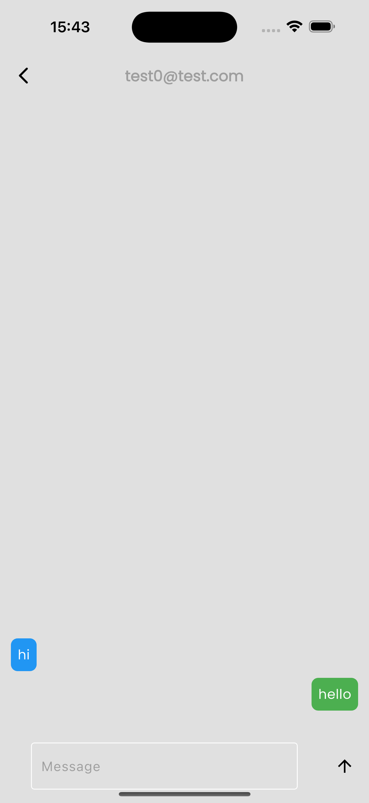
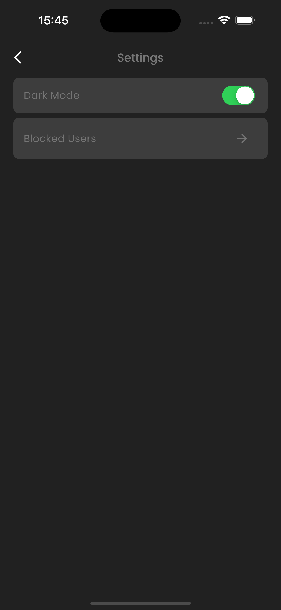
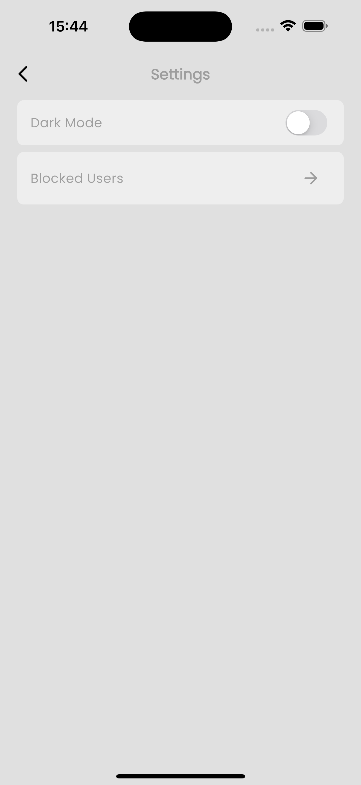

# pluschats

+Chats is a Flutter Chat Application, using Firebase for Sign In/Sign Up, and exchange texts.

## Getting Started

*   Clone this repo
*   Run `flutter packages get`
*   Run `flutter run` (remember to open simulator or connect physical device, iOS auto run additional command `pod install`)

## Setup

Connect the app to your Firebase Project from your [Firebase Console](http://console.firebase.google.com) and add the `google-services.json` in the `/android/app` directory.

OR

*   Install the CLI if not already done so
*   Run `dart pub global activate flutterfire_cli`
*   Run the `configure` command, select a Firebase project and platform `flutterfire configure`
*   Once configured, a firebase_options.dart file will be generated for you containing all the options required for initialization.

## ChatApp UI

  
  

  
  

## TODO

*   Integrate Video/Voice Calling.
*   Enable Group Chats.
*   Enable Group Calls.

## For Beginners

A few resources to get you started if this is your first Flutter project:

*   [Lab: Write your first Flutter app](https://flutter.dev/docs/get-started/codelab)
*   [Cookbook: Useful Flutter samples](https://flutter.dev/docs/cookbook)

For help getting started with Flutter, view our
[online documentation](https://flutter.dev/docs), which offers tutorials,
samples, guidance on mobile development, and a full API reference.

## License

This application is licensed under the GNU General Public License version 3 (GPLv3).  
You can find the full license text in the [LICENSE](./LICENSE) file.  
For more information about the GPL, visit [https://www.gnu.org/licenses/](https://www.gnu.org/licenses/).